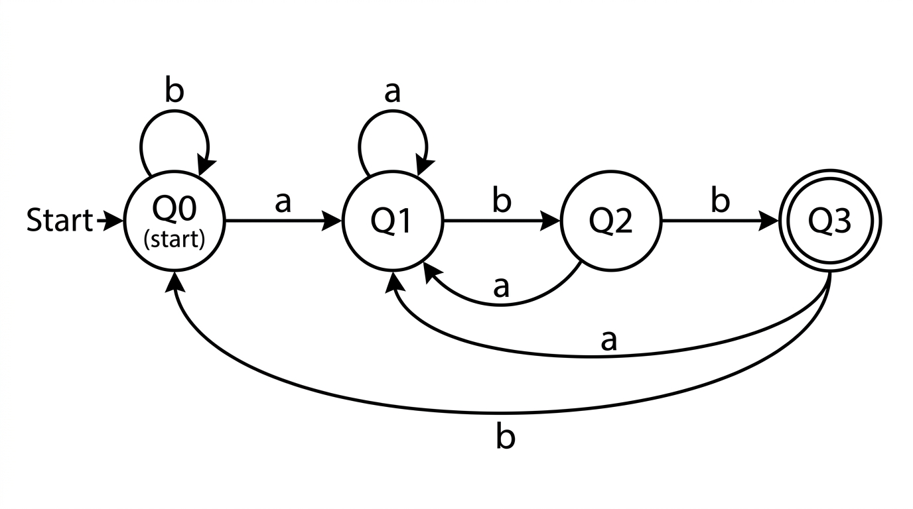

# Autómata Finito Determinista (AFD)

Esta tarea implementa un simulador de **Autómata Finito Determinista (AFD)** escrito en Python 3. El programa configura el autómata a partir de un archivo de configuración (`conf.txt`) y evalúa un archivo con cadenas de texto (`cadenas.txt`), mostrando el recorrido por cada estado y la decisión de aceptación o rechazo (incluyendo la detección explícita de errores de alfabeto).

---

## Descripción del Lenguaje

El autómata implementado reconoce el lenguaje representado por la expresión regular:

$$(a|b)^*abb$$

Este lenguaje acepta cualquier cadena formada exclusivamente por los símbolos `'a'` y `'b'` que **termine exactamente con la secuencia `abb`**.

---

## Diagrama de Transiciones de Estados

A continuación se muestra la gráfica de estados del autómata finito determinista:



---

## Formato del Archivo de Configuración (`conf.txt`)

El archivo de configuración define los estados, alfabeto, estado inicial, estados finales y la función de transición $\delta$:

```text
# Estados
Q0,Q1,Q2,Q3
# Alfabeto
a,b
# Estado inicial
Q0
# Estados finales
Q3
# Transiciones
Q0,a,Q1
Q0,b,Q0
Q1,a,Q1
Q1,b,Q2
Q2,a,Q1
Q2,b,Q3
Q3,a,Q1
Q3,b,Q0
```

---

## Instrucciones de Ejecución

Para ejecutar el simulador, utiliza el siguiente comando desde tu terminal:

```bash
python3 AFD.py conf.txt cadenas.txt
```

### Ejemplo de Salida por Consola

```text
=== Procesando cadenas con el AFD desde 'conf.txt' ===

Cadena: 'ababb' | Recorrido: Q0 -> Q1 -> Q2 -> Q1 -> Q2 -> Q3 | Resultado: ACEPTADA
Cadena: 'abb' | Recorrido: Q0 -> Q1 -> Q2 -> Q3 | Resultado: ACEPTADA
Cadena: 'aababb' | Recorrido: Q0 -> Q1 -> Q1 -> Q2 -> Q1 -> Q2 -> Q3 | Resultado: ACEPTADA
Cadena: 'a' | Recorrido: Q0 -> Q1 | Resultado: RECHAZADA (El estado final 'Q1' no es de aceptación)
Cadena: 'b' | Recorrido: Q0 -> Q0 | Resultado: RECHAZADA (El estado final 'Q0' no es de aceptación)
Cadena: 'aabb' | Recorrido: Q0 -> Q1 -> Q1 -> Q2 -> Q3 | Resultado: ACEPTADA
Cadena: 'bba' | Recorrido: Q0 -> Q0 -> Q0 -> Q1 | Resultado: RECHAZADA (El estado final 'Q1' no es de aceptación)
Cadena: 'abxbb' | Recorrido: Q0 -> Q1 -> Q2 | Resultado: RECHAZADA (Error: Símbolo 'x' no pertenece al alfabeto)
```
